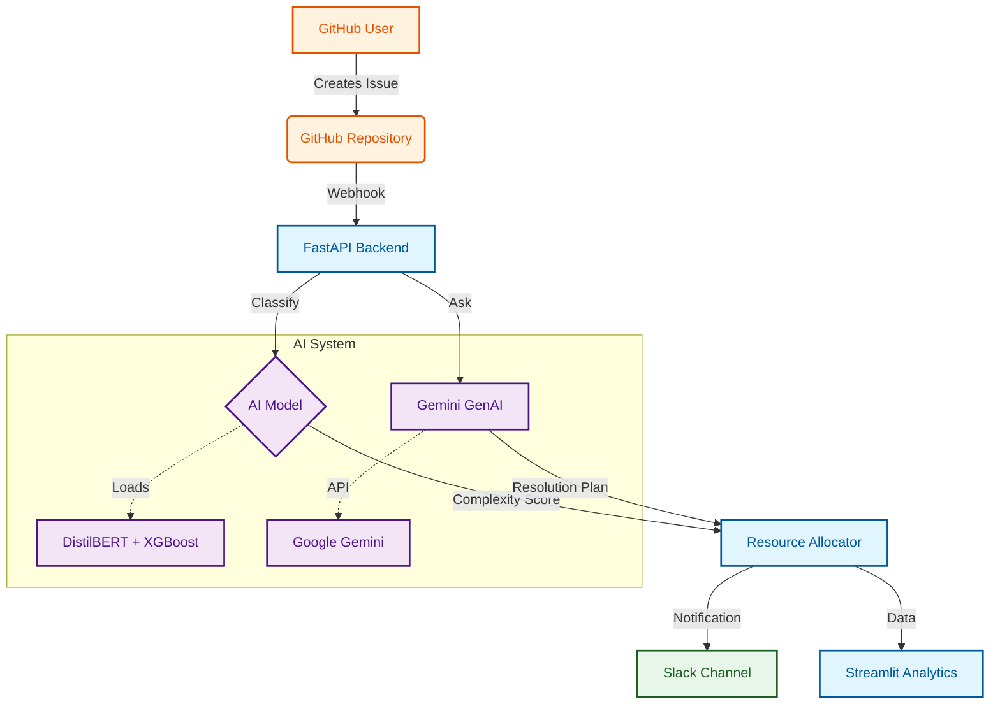
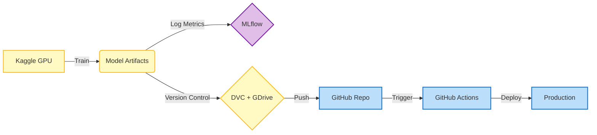

# 🚀 GitHub Issue Triage & Resource Allocation


An intelligent system to **classify GitHub issues**, **prioritize work**, and **automate triage** using Deep Learning (DistilBERT + XGBoost) and MLOps best practices.

## ✨ Key Features

- **🧠 AI-Powered**: Fine-tuned DistilBERT + XGBoost ensemble (53% Acc on complex tasks).
- **⚡ MLOps Integration**: DVC for data versioning, MLflow for tracking, GitHub Actions for CI/CD.
- **🔔 Smart Notifications**: Color-coded Slack alerts with team routing (@channel for complex issues).
- **🤖 GenAI Advisor**: Google Gemini integration for automated resolution strategies.
- **📊 Advanced Analytics**: Streamlit dashboard with trend analysis and resource planning.
- **🔄 Continuous Learning**: Feedback loop to retrain models on new data.

---

## 🛠️ Architecture

| Component | Tech Stack |
| :--- | :--- |
| **Model** | HuggingFace DistilBERT, XGBoost, Scikit-learn |
| **Backend** | FastAPI, Uvicorn, PyGithub |
| **Frontend** | Streamlit, Plotly |
| **MLOps** | DVC (Google Drive), MLflow, GitHub Actions |
| **Alerts** | Slack Webhooks |



---

## 🚀 Quick Start

### 1. Installation

```bash
git clone https://github.com/Pradnesh23/github-issue-triage-and-resource-planning.git
pip install -r requirements.txt
dvc pull  # Download model & data from Google Drive
```

### 2. Configuration

Create a `.env` file:

```env
GITHUB_TOKEN=ghp_...
SLACK_WEBHOOK_URL=https://hooks.slack.com/...
GEMINI_API_KEY=AIza...
```

### 3. Run

**API:**

```bash
uvicorn api.main:app --reload
```

**Dashboard:**

```bash
streamlit run app/streamlit_app.py
```

---

## 🤖 MLOps Workflow

1. **Train**: Run `notebooks/github-issue-predictor.ipynb` on Kaggle (GPU).
2. **Track**: Log results to MLflow (`python scripts/log_kaggle_run.py`).
3. **Version**: Push model to Google Drive (`dvc add ... && dvc push`).
4. **Deploy**: Push to GitHub → CI/CD runs tests & builds.



---

## 🔗 API Endpoints

| Method | Endpoint | Description |
| :--- | :--- | :--- |
| `POST` | `/predict` | Predict complexity for one issue |
| `POST` | `/predict_batch` | Batch predictions |
| `POST` | `/webhook/github` | Handle GitHub events |
| `GET`  | `/dataset/stats` | View training data stats |

> Full docs at `http://localhost:8000/docs`

---

## 📂 Project Structure

```text
├── .github/workflows/   # CI/CD (Test, DVC, Retrain, Deploy)
├── api/                 # FastAPI Backend
├── app/                 # Streamlit Dashboard
├── best_model_bert_3class/ # Production Model (DVC)
├── data/                # Dataset (DVC coverage)
├── notebooks/           # Training (Kaggle)
├── src/                 # Source Code
│   ├── models/          # Predictor & MLflow utils
│   └── notifications/   # Slack Notifier
└── dvc.yaml             # Pipeline Config
```

---

*Licensed under MIT.*
